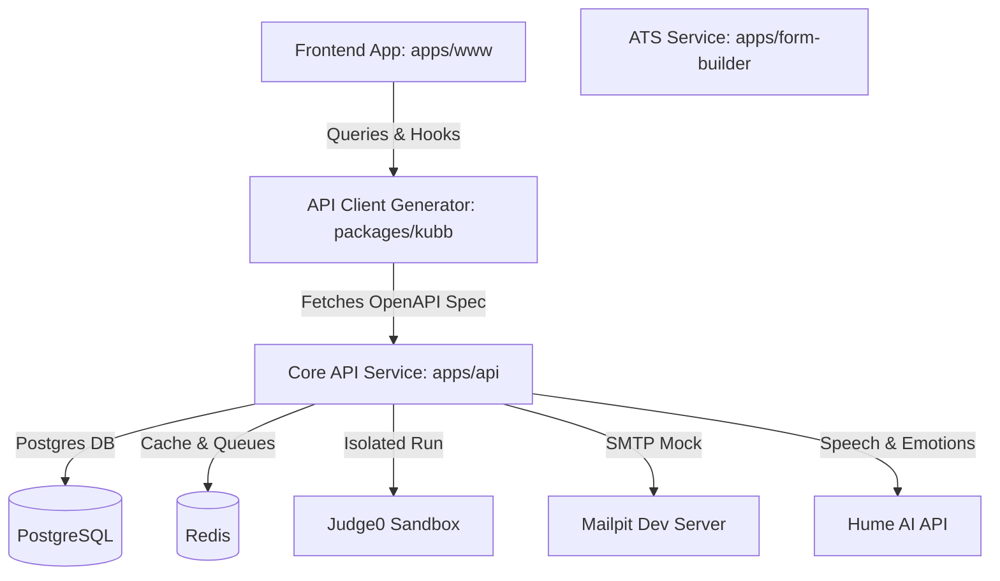

# Interviewer.ai - Comprehensive Project Documentation

Welcome to **Interviewer.ai**, a state-of-the-art, AI-powered interview preparation and career building platform. This document outlines the project's purpose, architectural design, core features, and detailed list of all technologies and libraries used across the monorepo.

---

## 1. Project Overview

**Interviewer.ai** is an advanced web-based platform designed to assist software engineers and professionals in preparing for technical and behavioral interviews. It simulates a real-world hiring environment by merging real-time adaptive AI communication, emotional analysis, coding assessment sandboxes, and professional resume building with ATS (Applicant Tracking System) optimizations. 

### Key Objectives
* **Realistic Interview Simulation**: Allowing candidates to interact with a conversational AI interviewer that adaptively changes follow-up questions depending on the candidate's answers.
* **Granular Analytical Feedback**: Measuring verbal fluency, confidence, clarity, sentiment, and emotional tone, providing actionable weekly recommendations.
* **Sandboxed Code Evaluation**: Running LeetCode-style coding tasks securely, validating outputs, checking execution performance, and providing automated code quality ratings.
* **Resume Optimization**: Auto-generating ATS-friendly resumes and matching them with specific job descriptions to point out missing keywords.

---

## 2. Monorepo Architecture

The project is structured as a **Turborepo Monorepo**, utilizing **Bun** as the package manager and runtime environment. The codebase is fully written in **TypeScript** and modularized into distinct applications and configuration packages:

### Directory Structure Details

* **`apps/www` (Frontend client)**: Built with Next.js (using the modern App Router) and styled with Tailwind CSS. It contains all interactive dashboards, the coding IDE workspace, the voice-enabled mock interview room, and the resume builder forms.
* **`apps/api` (Core backend API)**: An Express.js backend running on Bun. It handles user authentication, data management (via Prisma and PostgreSQL), background task queues (BullMQ), and API endpoints for interview generation and evaluation.
* **`apps/form-builder` (ATS Microservice)**: A Python environment managed by UV. It serves as a specialized microservice for parsing resumes, checking grammatical errors, calculating ATS scores, and generating optimized resume versions.
* **`packages/kubb` (API client generator)**: Uses Kubb CLI to generate API types, client SDKs, and TanStack React Query hooks directly from the Express API's generated OpenAPI schema.
* **`packages/typescript-config`**: Shared TypeScript configuration settings across the monorepo.
* **`judge0/`**: Code sandbox execution infrastructure containing Docker configuration and jobs runner definitions.

---

## 3. Core Features & Detailed Engineering Flows

### 🎙️ Feature A: AI Empathic Mock Interviews
This feature allows candidates to select an interview category (e.g., Data Structures, HR, System Design) and difficulty. 
1. **Interactive Audio Stream**: The frontend uses `@humeai/voice-react` to establish an Empathic Voice Interface (EVI) connection directly with Hume AI.
2. **Adaptive Conversation**: The AI interviewer asks questions sequentially, analyzing candidate audio. During the call, Hume extracts verbal cues (such as fluency, confidence, sentiment) and emotional expressions.
3. **Webhook Callback**: When the session ends, Hume sends a webhook payload to the `/api/hume/webhook` route in `apps/api`. This payload is verified via HMAC signatures (`x-hume-ai-webhook-signature`).
4. **Asynchronous Analysis**: The backend queues the transcripts in a Redis-backed **BullMQ** queue (`evaluate-answer`). A worker parses candidate answers, fetches ideal answers, and uses Vercel's AI SDK (connecting to Google Gemini or Ollama) to score relevance, clarity, and technical correctness.

### 💻 Feature B: Coding Practice & Sandboxed Evaluation
Candidates can solve algorithmic questions in a modern LeetCode-like environment.
1. **Monaco Code Editor**: The code is written in a Monaco-based IDE inside the browser, allowing multiple programming languages.
2. **AST Logic Caching**: When submitted, the backend uses `web-tree-sitter` and WASM language parsers (`tree-sitter-wasms`) to compute a canonical **Abstract Syntax Tree (AST) hash** of the code. 
   * If the AST hash matches an existing submission in the database, the system pulls the cached evaluation scores instantly, avoiding redundant sandbox execution.
3. **Judge0 Execution**: On a cache miss, the backend triggers compilation and test-case verification in the isolated Judge0 Sandbox.
4. **Scoring criteria**: Code is evaluated for Logic correctness, Naming conventions, Algorithmic efficiency, and Best Practices.

### 💼 Feature C: Resume Builder & ATS Optimizations
1. **Resume generation**: Candidates input their experience and achievements into a form to generate professional PDF templates.
2. **ATS Matcher**: The python `form-builder` service parses PDF text, compares it against pasted Job Descriptions (JDs), highlights keyword gaps, and suggests tailored modifications.

---

## 4. Complete Technology Stack & Libraries

### 🖥️ Frontend Client (`apps/www`)

| Category | Library/Technology | Purpose |
| :--- | :--- | :--- |
| **Core Framework** | Next.js 16 (App Router), React 19 | Standard modern framework for Server-Side Rendering (SSR) and Client-Side React rendering. |
| **Styling & UI Components**| Tailwind CSS 4, Radix UI, Lucide Icons | Responsive and harmonized style primitives, dynamic dark-mode toggling, and clean visual elements. |
| **Animations** | Motion (Framer Motion) | High-performance page transitions, loader screens, and dashboard animations. |
| **Code IDE** | `@monaco-editor/react`, `react-resizable-panels` | VS Code's editor engine embedded in the browser, featuring drag-and-drop panels. |
| **API State / SDK** | `@tanstack/react-query`, `@repo/kubb` | Handles API caching, asynchronous state management, and type-safe hooks. |
| **Realtime Voice Stream** | `@humeai/voice-react` | Connects directly to Hume EVI for audio input/output streaming. |
| **Interactive UX** | `canvas-confetti`, `@number-flow/react` | Celebration animations and smoothly rolling counter figures for statistics. |
| **Forms & Validation** | `react-hook-form`, `@hookform/resolvers`, `zod` | Validates form entries dynamically before sending data. |

---

### ⚙️ Core Backend Service (`apps/api`)

| Category | Library/Technology | Purpose |
| :--- | :--- | :--- |
| **Runtime & Server** | Bun runtime, Express.js | Ultra-fast execution environment running an Express REST API router. |
| **Database ORM** | Prisma ORM, `@prisma/client`, `@prisma/adapter-pg` | Type-safe mapping and database operations for PostgreSQL. |
| **Authentication** | `better-auth` | Flexible authentication system supporting sessions, client-side hooks, and OAuth providers. |
| **AI Integration** | `ai` (Vercel AI SDK), `@ai-sdk/google`, `ai-sdk-ollama` | Interfacing with Google Gemini models or Ollama local endpoints for structured evaluations. |
| **Realtime Analytics API**| `hume` | SDK to request access tokens, fetch audio chat events, and configure emotional prompts. |
| **Queues & Caching** | `bullmq`, `ioredis` | Redis-backed asynchronous worker manager for email alerts and AI evaluation pipelines. |
| **Email Services** | `nodemailer`, `@react-email/components` | Sends styled verification, recovery, and results emails using React components. |
| **AST Analysis** | `web-tree-sitter`, `tree-sitter-wasms` | Parses user source code into trees to generate canonical logic hashes. |
| **API Docs & Schemas** | `swagger-ui-express`, `@asteasolutions/zod-to-openapi` | Generates interactive Swagger documentation directly from API controllers. |

---

### 📦 Shared Monorepo Packages & Dev Tools

* **Turborepo (`turbo`)**: Builds, formats, and checks types in parallel across the workspace, utilizing local caching.
* **Biome (`@biomejs/biome`)**: Blazing fast formatter and linter replacement for ESLint & Prettier.
* **Kubb CLI (`@kubb/cli`)**: Code generation tool to map the Express backend REST OpenAPI spec to React Query hooks.
* **Husky (`husky`) & Commitlint**: Enforces high-quality commit standards and pre-commit hooks.
* **Knip**: Finds unused packages, dead exports, and duplicate dependencies across the monorepo.
* **Docker Compose**: Orchestrates multi-container development infrastructure.

---

## 5. Infrastructure & Docker Services

The development environment depends on several Docker services defined in `docker-compose.dev.yml` and `judge0/docker-compose.yml`:

1. **PostgreSQL 18** (`postgres`): Stores main application records (Users, Interviews, Submissions, Resumes).
2. **Redis 8** (`redis`): Manages BullMQ job pipelines and API caching.
3. **pgAdmin** (`pgadmin`): A web interface (at port 8080) to inspect database tables easily.
4. **Mailpit** (`mailpit`): Mock SMTP service catching outgoing developer emails, accessible at port 8025.
5. **Judge0 Sandbox** (`server`, `workers`, `db`, `redis`): Executes user-submitted code snippets safely in an isolated playground.

---
*Document generated for Interviewer.ai Graduation Project.*
